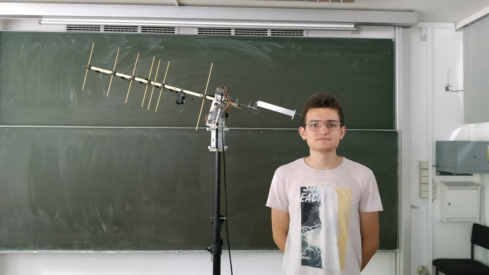
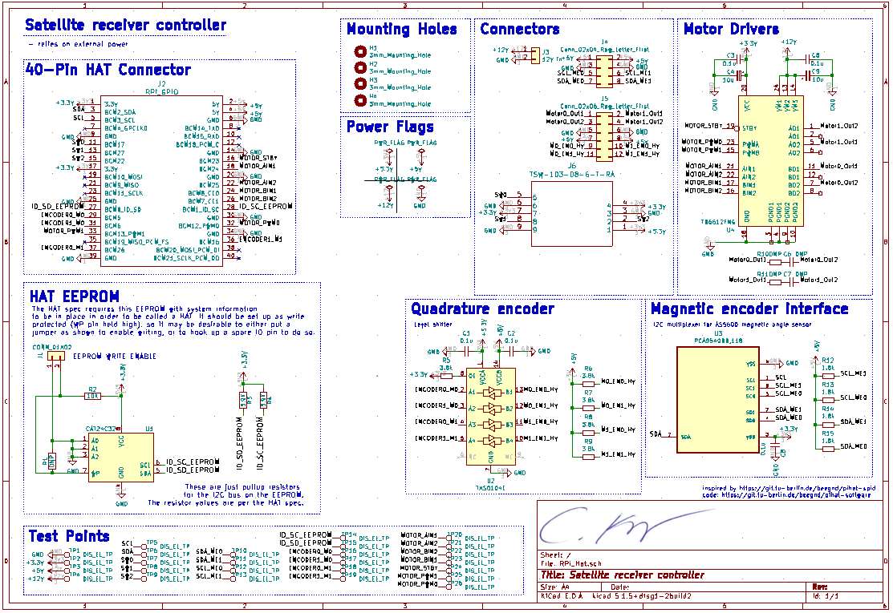
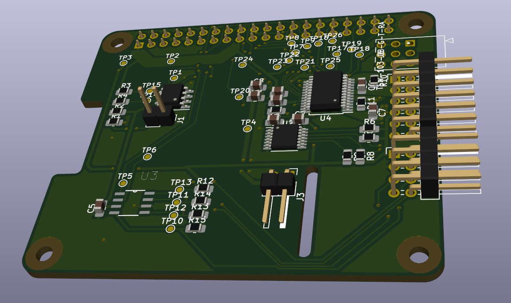
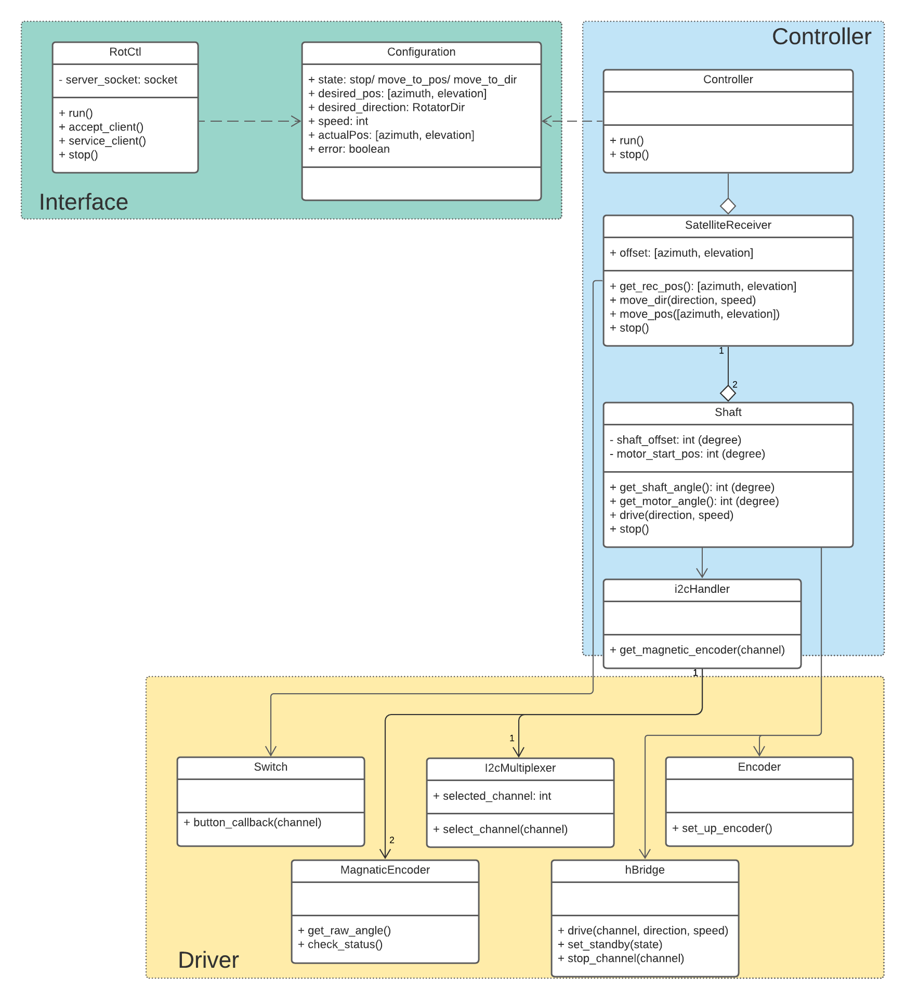

# Satellite Receiver

Student project: custom rotor design for portable ground station. \
Members of this group:
- Conrad Klaus (code and electronics)
- Prabhpreet S. Data (mechanics, prototype)
- Nasser Mazraani (final design build)

## PCB design
The pcb is designed as a raspberry pi hat to drive the motors and sensors.\
\

## Code
Main features:
- Rotctl
- Multithreading
- Sensors: magnetic encoder, quadrature
encoder, switches
- Separate driver modules: h-bridge, i2c
multiplexer etc.
- Position monitoring

For further information: ./src/README.md or ./documentation

Code structure: \

